# Contract Advocate

> **Autonomous AI Long-Horizon Freelance Contract & Payment Guardian**  
> *Built for the IGNITE Agentic AI Hackathon 2026*

Contract Advocate is an autonomous, serverless AI agent designed to protect freelancers and independent contractors. It parses freelance contracts for high-risk clauses and date-bound obligations (payment milestones, deliverable deadlines, renewal notice windows, and termination periods). Beyond static review, it acts as a long-horizon guardian: tracking deadlines over time, autonomously checking obligations daily, and drafting progressively escalating follow-up communications (from polite reminders to formal Small Claims Tribunal notices) when payments are overdue.

The entire architecture is 100% serverless, running on-demand with zero idle compute costs on AWS: **Amazon Bedrock (Claude 3.5 Haiku)**, **AWS Lambda**, **Amazon DynamoDB**, **Amazon SNS**, **Amazon SES**, and **Amazon EventBridge Scheduler**.

---

## Table of Contents

- [Overview & How It Works](#overview--how-it-works)
- [System Architecture](#system-architecture)
- [Repository Structure](#repository-structure)
- [Purpose of Each File & Script](#purpose-of-each-file--script)
- [How to Run the Code](#how-to-run-the-code)
  - [1. Live Interactive Web App (Instant / Zero Setup)](#1-live-interactive-web-app-instant--zero-setup)
  - [2. Local Python Environment & Terminal Demo](#2-local-python-environment--terminal-demo)
  - [3. Packaging Lambda Functions](#3-packaging-lambda-functions)
  - [4. Deploying to AWS](#4-deploying-to-aws)
  - [5. Demo Video & Transcript Studio](#5-demo-video--transcript-studio)
- [API Reference (Lambda Function URLs)](#api-reference-lambda-function-urls)
- [Escalation State Machine](#escalation-state-machine)
- [Multi-Channel Notification Dispatch](#multi-channel-notification-dispatch)
- [Known Limitations & Production Roadmap](#known-limitations--production-roadmap)

---

## Overview & How It Works

Freelancers frequently sign contracts with buried risks (such as unlimited liability, harsh indemnities, or unilateral termination) and struggle to track overdue invoices, milestone deadlines, and notice windows. Following up on late payments can be uncomfortable, time-consuming, and legally delicate.

Contract Advocate solves this end-to-end:

```
┌─────────────────┐       ┌──────────────────────┐       ┌──────────────────────┐
│  Upload PDF     │  ───> │  Bedrock Extraction  │  ───> │  Human-in-the-Loop   │
│  Contract       │       │  Risks & Milestones  │       │  Review & Confirm    │
└─────────────────┘       └──────────────────────┘       └──────────────────────┘
                                                                    │
                                                                    ▼
┌─────────────────┐       ┌──────────────────────┐       ┌──────────────────────┐
│ Multi-Channel   │ <───  │ Bedrock Escalation   │ <───  │ EventBridge Cron /   │
│ Alert (SNS/SES) │       │ Message Drafting     │       │ Daily State Machine  │
└─────────────────┘       └──────────────────────┘       └──────────────────────┘
```

1. **PDF Ingestion & Text Extraction**: Extracts clean text from text-based contractor agreements via `pdfplumber`.
2. **Autonomous Bedrock Contract Extraction**: Prompted with strict JSON output schemas, Amazon Bedrock (`anthropic.claude-3-5-haiku-20241022-v1:0`) parses:
   - **Flagged Clauses**: Categorized by severity (`high`, `medium`, `low`) with plain-English rationales of why the clause is unfavorable.
   - **Date-Bound Obligations**: Payment dues, deliverable deadlines, renewal notices, and termination windows with normalized `YYYY-MM-DD` dates and payment amounts.
3. **Human-in-the-Loop Confirmation**: The freelancer reviews the extracted obligations, edits any misread dates or amounts if necessary, and activates tracking.
4. **Long-Horizon Tracking**: The case state is persisted in Amazon DynamoDB. An EventBridge daily cron triggers evaluation of all active cases against today's date.
5. **Adaptive, Escalating Follow-Ups**: When an obligation passes its due date, the agent drafts the next escalation message using Bedrock, factoring in the previous communication history:
   - **Stage 0 (Polite Reminder)**: Friendly, assumes administrative oversight.
   - **Stage 1 (Firm Follow-Up)**: Professional, cites original invoice date and previous notice.
   - **Stage 2 (Small-Claims Final Notice)**: Formal notice, gives a 5-day deadline before escalating to the Small Claims Tribunal.
   - **Stage 3 (Legal Demand)**: Strict formal legal demand notice.
6. **Multi-Channel Dispatch & Deep-Link Action**: Overdue alerts are dispatched via AWS SNS (SMS/Topic) and AWS SES (Email) with deep links directly into the tracker. The UI also provides 1-click WhatsApp web dispatch with pre-filled message text.
7. **Time Simulation for Demo Verification**: Includes an `advance_time` simulation endpoint so multi-week escalation flows can be demonstrated and verified in minutes without waiting for real calendar days to elapse.

---

## System Architecture

```mermaid
flowchart TB
    subgraph Client ["Client / Frontend Layer"]
        GH["GitHub Pages / Local Browser\n(index.html)"]
        Demo["Demo Video Studio\n(demo_video/demo_player.html)"]
        WA["1-Click WhatsApp Dispatch"]
    end

    subgraph API ["Serverless Compute Layer (AWS Lambda)"]
        L1["create_case\n(POST /cases)"]
        L2["get_case\n(GET /cases/{id})"]
        L3["confirm_case\n(POST /cases/{id}/confirm)"]
        L4["timeline\n(GET /cases/{id}/timeline)"]
        L5["advance_time\n(POST /cases/{id}/advance-time)"]
        L6["daily_check\n(Scheduled Cron)"]
    end

    subgraph AI ["Foundation Model Layer"]
        BR["Amazon Bedrock\n(Claude 3.5 Haiku)\nConverse API with Retries"]
    end

    subgraph Data ["Data & Persistence"]
        DDB[("Amazon DynamoDB\nCases Table (On-Demand)")]
        S3[("Amazon S3\nUploads Bucket (Optional)")]
    end

    subgraph Notify ["Notification Services"]
        SNS["Amazon SNS\n(SMS / Push Topic)"]
        SES["Amazon SES\n(Email Alerts)"]
        EB["Amazon EventBridge\nScheduler (Daily 09:00 UTC)"]
    end

    GH -->|Upload PDF Base64| L1
    GH -->|Fetch Case Status| L2
    GH -->|Confirm Obligations| L3
    GH -->|Query Audit Trail| L4
    GH -->|Simulate Elapsed Days| L5
    EB -->|Daily Trigger| L6

    L1 -->|PDF Text & Structured Prompt| BR
    L1 -->|Write Initial Case| DDB
    L2 -->|Read Item| DDB
    L3 -->|Update Obligations & Status| DDB
    L4 -->|Read Case History| DDB
    L5 -->|Run State Machine| BR
    L5 -->|Update Case History| DDB
    L6 -->|Scan Active Cases| DDB
    L6 -->|Draft Escalation Message| BR

    L5 -.->|Trigger Alert| SNS
    L5 -.->|Trigger Alert| SES
    L6 -.->|Trigger Alert| SNS
    L6 -.->|Trigger Alert| SES
    SNS -.->|Alert with Deep Link| GH
    SES -.->|Alert with Deep Link| GH
    GH --> WA
```



---

## Repository Structure

```
contract-advocate/
├── .github/
│   └── workflows/
│       └── deploy-pages.yml      # GitHub Actions CI/CD to deploy static frontend to GitHub Pages
├── common/                       # Core shared business logic used by Lambdas & local scripts
│   ├── __init__.py               # Package marker
│   ├── config.py                 # Central configuration and environment variable loader
│   ├── bedrock_client.py         # Amazon Bedrock Converse API integration & prompt engineering
│   ├── dynamo.py                 # DynamoDB CRUD helpers & query abstractions
│   ├── notifier.py               # AWS SNS & SES multi-channel notification dispatcher
│   ├── pdf_utils.py              # Text-based PDF extraction via pdfplumber
│   └── state_machine.py          # Escalation logic, daily check runner, and time simulation
├── demo_video/                   # Official demo video and interactive playback studio
│   ├── contract_advocate_demo.mp4# Complete demonstration recording
│   ├── demo_player.html          # Interactive cinematic video player with synchronized transcripts
│   ├── demo_voiceover_full.mp3   # Voiceover narration track
│   ├── subtitles.srt             # Subtitle transcript file (SRT format)
│   └── subtitles.vtt             # WebVTT subtitle track for HTML5 video
├── lambdas/                      # AWS Lambda microservice handlers
│   ├── advance_time/             # POST /cases/{id}/advance-time (demo time accelerator)
│   ├── confirm_case/             # POST /cases/{id}/confirm (human-in-the-loop review)
│   ├── create_case/              # POST /cases (PDF base64 ingestion and analysis)
│   ├── daily_check/              # Scheduled daily batch runner triggered by EventBridge
│   ├── get_case/                 # GET /cases/{id} (fetches case metadata and obligations)
│   └── timeline/                 # GET /cases/{id}/timeline (fetches chronological audit events)
├── scripts/                      # Local testing, utility, and build scripts
│   ├── package_lambda.py         # Cross-platform Lambda zip builder targeting AWS Linux x86_64
│   ├── run_local_demo.py         # End-to-end local terminal demo (no AWS deployment required)
│   └── setup_dynamodb.py         # Idempotent script to create the DynamoDB Cases table
├── tests/
│   └── sample_contract.txt       # Plaintext sample contract for extraction testing
├── .env.example                  # Environment configuration template
├── .gitignore                    # Git ignore file
├── build_lambda.ps1              # Windows PowerShell packaging helper
├── build_lambda.sh               # Linux / macOS Bash packaging helper
├── index.html                    # Modern single-page web app dashboard (hosted on GitHub Pages)
├── requirements.txt              # Core Python dependencies
├── test_bedrock.py               # Connectivity test for Amazon Bedrock access
└── testcontract.pdf              # Sample PDF agreement used for 1-click test uploads
```

---

## Purpose of Each File & Script

### Root Files
- **[`index.html`](file:///c:/Users/alana/Desktop/contract-advocate/contract-advocate/index.html)**: The frontend single-page application. Features a responsive dashboard built with semantic HTML and modern CSS (glassmorphic styling, risk cards, editable tables, dynamic audit timelines, 1-click test contract loader, clipboard message copy, and WhatsApp web link generator). Communicates directly with live Lambda Function URLs.
- **[`testcontract.pdf`](file:///c:/Users/alana/Desktop/contract-advocate/contract-advocate/testcontract.pdf)**: Realistic sample freelance consulting contract (PDF format) containing risky indemnity clauses, IP assignments, milestone deadlines, and payment terms for testing.
- **[`test_bedrock.py`](file:///c:/Users/alana/Desktop/contract-advocate/contract-advocate/test_bedrock.py)**: Rapid connectivity smoke test that queries Amazon Bedrock with a simple prompt (`"Say hello in one sentence."`) to verify AWS credentials and model access.
- **[`requirements.txt`](file:///c:/Users/alana/Desktop/contract-advocate/contract-advocate/requirements.txt)**: Core dependencies (`boto3`, `python-dotenv`, `pdfplumber`).
- **[`.env.example`](file:///c:/Users/alana/Desktop/contract-advocate/contract-advocate/.env.example)**: Example environment file defining region, model ID, table name, and sandbox credentials.
- **[`build_lambda.ps1`](file:///c:/Users/alana/Desktop/contract-advocate/contract-advocate/build_lambda.ps1)**: PowerShell packaging helper invoking `scripts/package_lambda.py` on Windows.
- **[`build_lambda.sh`](file:///c:/Users/alana/Desktop/contract-advocate/contract-advocate/build_lambda.sh)**: Shell script packaging helper for Linux/macOS.

### Shared Logic (`common/`)
- **[`common/config.py`](file:///c:/Users/alana/Desktop/contract-advocate/contract-advocate/common/config.py)**: Loads `.env` file; sets sensible defaults for `AWS_REGION` (`us-east-1`), `BEDROCK_MODEL_ID` (`anthropic.claude-3-5-haiku-20241022-v1:0`), `DYNAMODB_TABLE` (`Cases`), and `S3_BUCKET` (`contract-advocate-uploads`).
- **[`common/pdf_utils.py`](file:///c:/Users/alana/Desktop/contract-advocate/contract-advocate/common/pdf_utils.py)**: Extracts plain text from raw PDF bytes or file paths using `pdfplumber`. Designed for standard text-based contracts.
- **[`common/bedrock_client.py`](file:///c:/Users/alana/Desktop/contract-advocate/contract-advocate/common/bedrock_client.py)**: Wrapper around AWS Bedrock runtime using the `converse` API.
  - Features an automatic fallback model list (`claude-3-5-haiku`, `claude-3-haiku`) across regions.
  - Implements `extract_contract_json()` with retry logic and markdown code-fence sanitization.
  - Implements `draft_followup_message()` to dynamically write escalation notices based on stage and previous communication history, with offline fallback templates.
- **[`common/dynamo.py`](file:///c:/Users/alana/Desktop/contract-advocate/contract-advocate/common/dynamo.py)**: Encapsulates all DynamoDB operations: `create_case`, `get_case`, `update_case` (dynamic update expressions), `append_message`, and `list_open_cases`.
- **[`common/state_machine.py`](file:///c:/Users/alana/Desktop/contract-advocate/contract-advocate/common/state_machine.py)**: Houses the agentic "plans, acts, adapts over time" decision engine.
  - `process_case()`: Checks overdue dates, evaluates previous actions, drafts follow-up messages via Bedrock, updates case state, and triggers notifications.
  - `advance_time()`: Simulates time travel forward by `N` days for interactive demos.
  - `run_daily_check()`: Batch processor for all open cases, called daily by EventBridge.
- **[`common/notifier.py`](file:///c:/Users/alana/Desktop/contract-advocate/contract-advocate/common/notifier.py)**: Multi-channel dispatch engine. Publishes alerts to AWS SNS (SMS/Topic) and AWS SES (Email), including deep-links (`/?case_id=<ID>`) back to the web tracker.

### Lambda Handlers (`lambdas/`)
- **[`lambdas/create_case/handler.py`](file:///c:/Users/alana/Desktop/contract-advocate/contract-advocate/lambdas/create_case/handler.py)**: Handles `POST /cases`. Decodes base64 PDF bytes, extracts text, calls Bedrock to extract clauses and obligations, creates a new DynamoDB record, and returns `case_id`. Includes CORS support.
- **[`lambdas/get_case/handler.py`](file:///c:/Users/alana/Desktop/contract-advocate/contract-advocate/lambdas/get_case/handler.py)**: Handles `GET /cases/{case_id}` (supporting path parameters, query parameters, and raw paths). Returns full case record.
- **[`lambdas/confirm_case/handler.py`](file:///c:/Users/alana/Desktop/contract-advocate/contract-advocate/lambdas/confirm_case/handler.py)**: Handles `POST /cases/{case_id}/confirm`. Allows the user to confirm or edit obligations, transitioning status to `AWAITING_PAYMENT`.
- **[`lambdas/timeline/handler.py`](file:///c:/Users/alana/Desktop/contract-advocate/contract-advocate/lambdas/timeline/handler.py)**: Handles `GET /cases/{case_id}/timeline`. Merges status events and message history into a chronological audit trail.
- **[`lambdas/advance_time/handler.py`](file:///c:/Users/alana/Desktop/contract-advocate/contract-advocate/lambdas/advance_time/handler.py)**: Handles `POST /cases/{case_id}/advance-time`. Simulates `N` days passing to trigger overdue evaluation and draft messages for demo validation.
- **[`lambdas/daily_check/handler.py`](file:///c:/Users/alana/Desktop/contract-advocate/contract-advocate/lambdas/daily_check/handler.py)**: Scheduled handler triggered by EventBridge Scheduler. Scans all active cases and executes daily checks.

### Scripts (`scripts/`)
- **[`scripts/package_lambda.py`](file:///c:/Users/alana/Desktop/contract-advocate/contract-advocate/scripts/package_lambda.py)**: Automated packaging script.
  - For `create_case`: Downloads Linux-compatible binary wheels (`--platform manylinux2014_x86_64`) for dependencies such as `pdfplumber` and `cryptography`, bundling them alongside `common/` and `handler.py`. Works seamlessly from Windows, macOS, or Linux.
  - For lightweight Lambdas (`get_case`, `confirm_case`, `timeline`, `advance_time`, `daily_check`): Bundles `common/` and handler directly without unnecessary dependencies, keeping zip files tiny (<20 KB).
- **[`scripts/setup_dynamodb.py`](file:///c:/Users/alana/Desktop/contract-advocate/contract-advocate/scripts/setup_dynamodb.py)**: Idempotent initialization script that creates the DynamoDB `Cases` table with on-demand capacity (`PAY_PER_REQUEST`).
- **[`scripts/run_local_demo.py`](file:///c:/Users/alana/Desktop/contract-advocate/contract-advocate/scripts/run_local_demo.py)**: Standalone terminal demonstration. Ingests `sample_contract.txt`, runs Bedrock extraction, creates a DynamoDB record, simulates time advancement, and prints drafted escalation messages directly to stdout.

### Demo & Media (`demo_video/` & `.github/`)
- **[`demo_video/demo_player.html`](file:///c:/Users/alana/Desktop/contract-advocate/contract-advocate/demo_video/demo_player.html)**: Standalone cinematic video player dashboard with synchronized interactive transcript seeking, feature highlights, and video controls.
- **[`.github/workflows/deploy-pages.yml`](file:///c:/Users/alana/Desktop/contract-advocate/contract-advocate/.github/workflows/deploy-pages.yml)**: GitHub Actions workflow that automatically publishes `index.html`, `testcontract.pdf`, and the `demo_video/` assets to GitHub Pages on every push to `main`.

---

## How to Run the Code

### 1. Live Interactive Web App (Instant / Zero Setup)

The frontend is deployed and hosted on GitHub Pages:
- **Hosted Application URL**: [https://alanantony24.github.io/contract-advocate/](https://alanantony24.github.io/contract-advocate/)
- **Demo Video Studio**: [https://alanantony24.github.io/contract-advocate/demo_video/demo_player.html](https://alanantony24.github.io/contract-advocate/demo_video/demo_player.html)

#### Running the Frontend Locally:
You can also run the web dashboard locally using any static web server:

```bash
# Using Python
python -m http.server 3000

# OR using Node
npx serve .
```

Open `http://localhost:3000` in your browser. The app connects directly to live AWS Lambda Function URLs. Click **"Load Sample Contract"** to test immediately using `testcontract.pdf`.

---

### 2. Local Python Environment & Terminal Demo

Run the entire pipeline from your local terminal using your AWS credentials.

#### Step 1: Create a Python 3.12 virtual environment

**macOS / Linux:**
```bash
python3 -m venv venv
source venv/bin/activate
pip install -r requirements.txt
```

**Windows (PowerShell):**
```powershell
py -3.12 -m venv venv
.\venv\Scripts\Activate.ps1
pip install -r requirements.txt
```

#### Step 2: Configure Environment Variables

Copy `.env.example` to `.env`:

```powershell
# Windows
Copy-Item .env.example .env

# macOS / Linux
cp .env.example .env
```

Fill in your AWS credentials in `.env`:

```env
AWS_ACCESS_KEY_ID=ASIA...
AWS_SECRET_ACCESS_KEY=...
AWS_SESSION_TOKEN=...
AWS_REGION=us-east-1
BEDROCK_MODEL_ID=anthropic.claude-3-5-haiku-20241022-v1:0
DYNAMODB_TABLE=Cases
S3_BUCKET=contract-advocate-uploads
```

> **Note**: AWS sandbox credentials expire every ~12 hours. Refresh them in `.env` if requests fail with `ExpiredTokenException`.

#### Step 3: Test Bedrock Access

```bash
python test_bedrock.py
```
*Expected output*: A one-sentence greeting from Claude 3.5 Haiku confirming Bedrock connectivity.

#### Step 4: Create the DynamoDB Table

```bash
python scripts/setup_dynamodb.py
```
*Expected output*: `Creating table 'Cases'...` (or `Table 'Cases' already exists - skipping`).

#### Step 5: Run the End-to-End Terminal Demo

```bash
python scripts/run_local_demo.py
```
This executes the full agentic flow in terminal:
1. Extracts clauses and obligations from `tests/sample_contract.txt`.
2. Creates and persists a case in DynamoDB.
3. Confirms the case (`AWAITING_PAYMENT`).
4. Simulates time passing (+25 days) past the due date.
5. Bedrock drafts an overdue reminder message.
6. Simulates additional time (+35 days) and prints the escalated Small Claims notice.

---

### 3. Packaging Lambda Functions

Lambda requires packages built for Amazon Linux x86_64. The included `package_lambda.py` script automatically fetches the correct `manylinux2014_x86_64` wheels for binary dependencies (such as `pdfplumber` and `cryptography`), allowing you to package on **Windows, macOS, or Linux** without needing Docker or WSL.

#### Packaging via PowerShell (Windows):
```powershell
.\build_lambda.ps1 create_case
.\build_lambda.ps1 get_case
.\build_lambda.ps1 confirm_case
.\build_lambda.ps1 timeline
.\build_lambda.ps1 advance_time
.\build_lambda.ps1 daily_check
```

#### Packaging via Bash (Linux / macOS):
```bash
chmod +x build_lambda.sh
./build_lambda.sh create_case
./build_lambda.sh get_case
./build_lambda.sh confirm_case
./build_lambda.sh timeline
./build_lambda.sh advance_time
./build_lambda.sh daily_check
```

#### Packaging directly with Python:
```bash
python scripts/package_lambda.py create_case
```

Output archives are generated in `build/<lambda_name>.zip`.

---

### 4. Deploying to AWS

#### Step 1: Create the DynamoDB Table
Run `python scripts/setup_dynamodb.py` or create a table named `Cases` in the AWS Console with:
- **Partition Key**: `case_id` (String)
- **Capacity Mode**: On-Demand (`PAY_PER_REQUEST`)

#### Step 2: Create Lambda Functions
For each of the six functions (`create_case`, `get_case`, `confirm_case`, `timeline`, `advance_time`, `daily_check`):

1. **AWS Lambda Console** > **Create function** > **Author from scratch**
2. **Runtime**: Python 3.12
3. **Architecture**: x86_64
4. **Code Tab**: Click **Upload from** > **.zip file** > select `build/<lambda_name>.zip`
5. **Runtime Settings**: Set Handler to `handler.lambda_handler`
6. **General Configuration**:
   - `create_case`: Set Memory to **512 MB**, Timeout to **30 seconds** (needed for PDF parsing + Bedrock inference).
   - Other Lambdas: Set Memory to **128 MB**, Timeout to **10 seconds**.

#### Step 3: Configure Environment Variables
In Lambda Console under **Configuration** > **Environment variables**:

```env
AWS_REGION=us-east-1
BEDROCK_MODEL_ID=anthropic.claude-3-5-haiku-20241022-v1:0
DYNAMODB_TABLE=Cases
S3_BUCKET=contract-advocate-uploads
```

*(Optional multi-channel notification variables)*:
```env
SNS_TOPIC_ARN=arn:aws:sns:us-east-1:YOUR_ACCOUNT_ID:ContractAdvocateAlerts
SES_SENDER_EMAIL=notifications@yourdomain.com
DEFAULT_USER_EMAIL=freelancer@example.com
```

> **Security Note**: Never add `AWS_ACCESS_KEY_ID` or `AWS_SECRET_ACCESS_KEY` to Lambda environment variables. Lambda automatically assumes its IAM Execution Role.

#### Step 4: IAM Execution Role Permissions
Attach an inline policy to the Lambda execution role:

```json
{
  "Version": "2012-10-17",
  "Statement": [
    {
      "Sid": "BedrockInvoke",
      "Effect": "Allow",
      "Action": ["bedrock:InvokeModel"],
      "Resource": "*"
    },
    {
      "Sid": "DynamoTableAccess",
      "Effect": "Allow",
      "Action": [
        "dynamodb:GetItem",
        "dynamodb:PutItem",
        "dynamodb:UpdateItem",
        "dynamodb:Scan"
      ],
      "Resource": "arn:aws:dynamodb:*:*:table/Cases"
    },
    {
      "Sid": "NotificationAccess",
      "Effect": "Allow",
      "Action": [
        "sns:Publish",
        "ses:SendEmail"
      ],
      "Resource": "*"
    }
  ]
}
```

#### Step 5: Enable Function URLs
For each HTTP-facing Lambda (`create_case`, `get_case`, `confirm_case`, `timeline`, `advance_time`):
1. **Configuration** > **Function URL** > **Create function URL**
2. **Auth type**: `NONE`
3. **Configure CORS**:
   - Allow Origin: `*`
   - Allow Headers: `Content-Type,Authorization,X-Amz-Date,X-Api-Key,X-Amz-Security-Token`
   - Allow Methods: `GET,POST,OPTIONS`

#### Step 6: Configure EventBridge Scheduler for `daily_check`
1. Go to **Amazon EventBridge** > **Schedules** > **Create schedule**
2. **Schedule pattern**: Recurring schedule > `cron(0 9 * * ? *)` (runs daily at 09:00 UTC)
3. **Target**: AWS Lambda > select `daily_check`

---

### 5. Demo Video & Transcript Studio

The project includes an interactive video demonstration studio in [`demo_video/demo_player.html`](file:///c:/Users/alana/Desktop/contract-advocate/contract-advocate/demo_video/demo_player.html):
- **Live Stream / Playback**: Embedded HTML5 player playing `contract_advocate_demo.mp4`.
- **Synchronized Transcripts**: Clickable SRT / WebVTT subtitles synchronized with video playback timestamps.
- **Narrated Audio Track**: Includes standalone voiceover track `demo_voiceover_full.mp3`.

Access it online at:  
[https://alanantony24.github.io/contract-advocate/demo_video/demo_player.html](https://alanantony24.github.io/contract-advocate/demo_video/demo_player.html)

---

## API Reference (Lambda Function URLs)

### 1. Create Case
**`POST /cases`**

Uploads base64-encoded PDF contract bytes for parsing.

- **Request Body**:
  ```json
  {
    "user_id": "demo-freelancer",
    "pdf_base64": "<base64_encoded_pdf_bytes>"
  }
  ```
- **Response** (`200 OK`):
  ```json
  {
    "case_id": "3a824e81-79cb-4c28-98e3-057bfd9d8bf4",
    "status": "EXTRACTED"
  }
  ```

---

### 2. Get Case Details
**`GET /cases/{case_id}`**

Retrieves the complete case state, extracted clauses, obligations, and history.

- **Response** (`200 OK`):
  ```json
  {
    "case_id": "3a824e81-79cb-4c28-98e3-057bfd9d8bf4",
    "user_id": "demo-freelancer",
    "status": "AWAITING_PAYMENT",
    "clauses_flagged": [
      {
        "clause_text": "Contractor shall indemnify Client against all claims...",
        "risk_level": "high",
        "reason": "Uncapped indemnity creates unlimited financial liability."
      }
    ],
    "obligations": [
      {
        "type": "payment_due",
        "date": "2026-09-15",
        "amount": "3500",
        "party_responsible": "Acme Corp",
        "description": "Milestone 2 Final Deliverable Payment",
        "status": "PENDING"
      }
    ],
    "escalation_stage": 0,
    "last_action_date": "2026-09-06",
    "message_history": []
  }
  ```

---

### 3. Confirm Case & Start Tracking
**`POST /cases/{case_id}/confirm`**

Confirms extracted milestones and activates autonomous tracking. Freelancers can edit or override any extracted fields.

- **Request Body** (optional overrides):
  ```json
  {
    "case_id": "3a824e81-79cb-4c28-98e3-057bfd9d8bf4",
    "obligations": [
      {
        "type": "payment_due",
        "date": "2026-09-15",
        "amount": "3500",
        "party_responsible": "Acme Corp",
        "description": "Milestone 2 Final Deliverable Payment",
        "status": "PENDING"
      }
    ]
  }
  ```
- **Response** (`200 OK`):
  ```json
  {
    "status": "AWAITING_PAYMENT"
  }
  ```

---

### 4. Case Audit Timeline
**`GET /cases/{case_id}/timeline`**

Returns chronological event logs, status changes, and drafted communication records.

- **Response** (`200 OK`):
  ```json
  {
    "case_id": "3a824e81-79cb-4c28-98e3-057bfd9d8bf4",
    "events": [
      {
        "date": "2026-09-06",
        "type": "STATUS",
        "detail": "AWAITING_PAYMENT"
      },
      {
        "date": "2026-09-20",
        "type": "escalation_stage_0",
        "stage_label": "Stage 0 (Polite Reminder)",
        "content": "Hi Acme Corp, I hope you are doing well..."
      }
    ]
  }
  ```

---

### 5. Advance Time (Demo Acceleration)
**`POST /cases/{case_id}/advance-time`**

Fast-forwards simulated time by `N` days to test escalation flows in live demonstrations.

- **Request Body**:
  ```json
  {
    "case_id": "3a824e81-79cb-4c28-98e3-057bfd9d8bf4",
    "days": 25
  }
  ```
- **Response** (`200 OK`): Full updated case object showing new status (`REMINDER_SENT`, `ESCALATED_1`, etc.) and drafted messages.

---

## Escalation State Machine

The state machine ([`common/state_machine.py`](file:///c:/Users/alana/Desktop/contract-advocate/contract-advocate/common/state_machine.py)) regulates how the agent plans, acts, and escalates over time:

| Escalation Stage | Trigger Condition | Tone & Behavior | Target Output |
|---|---|---|---|
| **Stage 0** | Obligation overdue (`days_overdue >= 0`) | Polite, collaborative reminder; assumes an oversight. | Friendly email/text to client inquiring if invoice needs approval details. |
| **Stage 1** | Overdue + previous reminder sent (`days_since_last >= 7`) | Firm and direct; references original due date and prior communication. | Clear follow-up requesting an updated payment processing date. |
| **Stage 2** | Overdue + Stage 1 unanswered | Formal legal notice; sets strict 5-day deadline. | Cites small claims dispute resolution channels (e.g. Small Claims Tribunal). |
| **Stage 3** | Overdue + Stage 2 expired (Hard Cap) | Final formal legal demand notice. | Prepares documentation for legal filing; prevents infinite message loops. |

---

## Multi-Channel Notification Dispatch

When an obligation becomes overdue and a new escalation message is drafted, Contract Advocate alerts the freelancer across multiple channels:

1. **AWS SNS (SMS / Topic)**: Publishes immediate alerts to registered phone numbers or SNS topic subscribers.
2. **AWS SES (Email)**: Sends a formatted email containing the client name, overdue amount, stage label, drafted message, and deep-link.
3. **Deep-Link URL**: Every alert includes a direct URL (`https://alanantony24.github.io/contract-advocate/?case_id=<CASE_ID>`). Clicking opens the dashboard directly in the case tracker.
4. **1-Click WhatsApp Web Dispatch**: The web UI automatically formats and encodes the drafted message into an instant WhatsApp link (`https://api.whatsapp.com/send?text=...`) for one-tap client dispatch.

---

## Known Limitations & Production Roadmap

- **Text-Based PDFs vs. Scanned Images**: The current ingestion pipeline uses `pdfplumber` for text extraction. Scanned PDFs or image-based contracts require an OCR preprocessing pipeline (e.g. AWS Textract).
- **Demo Time Simulator (`advance_time`)**: The `advance_time` endpoint is explicitly provided for hackathon evaluation and demonstrations. In a production deployment, this endpoint would be restricted or removed.
- **DynamoDB Table Scanning**: The `daily_check` function performs a DynamoDB scan filtered by `status != 'RESOLVED'`. At large scale, this should be backed by a Global Secondary Index (GSI) on `status`.
- **Authentication**: For hackathon evaluation and ease of testing, Lambda Function URLs are configured with `AuthType=NONE` and CORS enabled. Production environments should enforce AWS Cognito JWT or API Gateway IAM authorizers.
- **Additional Obligation Types**: While deliverable deadlines, renewal notice windows, and termination periods are extracted and displayed on the timeline, autonomous escalation is currently focused on `payment_due` obligations. Expanding tailored reminder workflows to renewal windows is planned on the roadmap.

---

## License

Developed under the MIT License. Built for the IGNITE Agentic AI Hackathon 2026.
